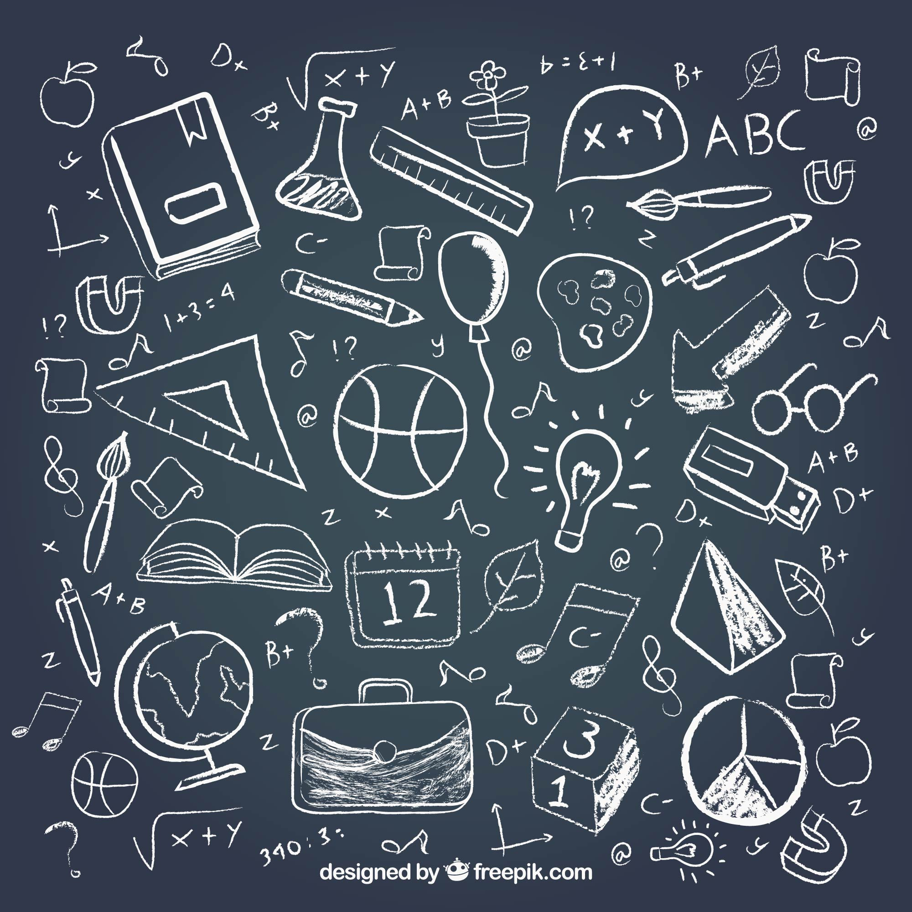

# Today I Learned

Though I doubt I'll remember to commit new links each day I learn something new, this will serve as the place where I list things I learned and want to reference again.
 &mdash;Diana.

Repository here: https://github.com/dianawhalen/til

## Guidelines

Tips, tricks, resources, factoids, etc...

Will clarify how topics and subtopics are categorized, as well as defining folder structure, once I've determined what makes the most sense to me.

## Inspired by

 * (will link inspiration pages/repos here)

## Topics

|Topic|Name|# Articles|
|------|------|----------|

| Markdown | [Daring Fireball](https://daringfireball.net/projects/markdown/) | 1 articles |
